# Olympus Convertible Deposits Subgraph

An Envio indexer for tracking Olympus Protocol's Convertible Deposits system. This subgraph indexes events from three main contracts to provide comprehensive data about deposit positions, auctions, redemptions, and yield generation.

## Overview

The Olympus Convertible Deposits system allows users to deposit various assets (starting with USDS) for fixed periods and receive OHM tokens through an auction mechanism. The system includes:

- **ConvertibleDepositAuctioneer**: Manages auctions for converting deposits to OHM
- **ConvertibleDepositFacility**: Handles deposit creation, conversion, and yield management
- **DepositRedemptionVault**: Manages redemption of the deposit with loan mechanisms

## Key Features

### 🏦 Deposit Management
- Track deposit positions across different assets and time periods
- Monitor deposit creation, conversion, and remaining balances
- Support for multiple deposit periods (e.g., 3, 6, 12 months)

### 🎯 Auction System
- Auction mechanism for converting deposits to OHM
- Real-time auction parameter tracking (target, tick size, minimum price)
- Bid tracking and auction result monitoring
- Deposit period enable/disable management

### 💰 Yield & Redemption
- Early redemption system with loan mechanisms
- Interest rate tracking and loan management
- Yield claiming and asset commitment tracking
- Reclaim rate configuration per asset period

### 📊 Comprehensive Analytics
- Real-time snapshots of auctioneer and facility states
- Historical tracking of all events and state changes
- Multi-asset support with proper decimal normalization
- Cross-contract relationship mapping

## Architecture

### Entity Relationship Diagram

```mermaid
erDiagram
    Asset ||--o{ DepositAsset : "has many"
    DepositAsset ||--o{ DepositAssetPeriod : "has periods"
    DepositAsset ||--o{ Auctioneer : "has auctioneer"
    DepositAsset ||--o{ DepositRedemptionVaultAssetConfiguration : "has config"

    DepositAssetPeriod ||--o{ ReceiptToken : "generates"
    DepositAssetPeriod ||--o{ ConvertibleDepositPosition : "contains"
    DepositAssetPeriod ||--o{ AuctioneerDepositPeriod : "configured in"
    DepositAssetPeriod ||--o{ Redemption : "redeemed from"

    Auctioneer ||--o{ AuctioneerDepositPeriod : "manages"
    Auctioneer ||--o{ AuctioneerSnapshot : "snapshotted"
    Auctioneer ||--o{ ConvertibleDepositAuctioneer_AuctionParametersUpdated : "emits"
    Auctioneer ||--o{ ConvertibleDepositAuctioneer_AuctionResult : "emits"
    Auctioneer ||--o{ ConvertibleDepositAuctioneer_Bid : "receives"

    AuctioneerDepositPeriod ||--o{ AuctioneerDepositPeriodSnapshot : "snapshotted"
    AuctioneerDepositPeriod ||--o{ ConvertibleDepositAuctioneer_Bid : "receives bids"

    DepositFacility ||--o{ DepositFacilityAsset : "manages"
    DepositFacility ||--o{ ConvertibleDepositPosition : "holds"
    DepositFacility ||--o{ ReceiptToken : "issues"
    DepositFacility ||--o{ Redemption : "processes"
    DepositFacility ||--o{ DepositFacilitySnapshot : "snapshotted"
    DepositFacility ||--o{ DepositRedemptionVaultAssetConfiguration : "configured in"

    DepositFacilityAsset ||--o{ DepositFacilityAssetPeriod : "has periods"
    DepositFacilityAsset ||--o{ DepositFacilityAssetSnapshot : "snapshotted"

    DepositFacilityAssetPeriod ||--o{ ConvertibleDepositPosition : "contains"
    DepositFacilityAssetPeriod ||--o{ ConvertibleDepositFacility_CreatedDeposit : "creates"
    DepositFacilityAssetPeriod ||--o{ ConvertibleDepositFacility_ConvertedDeposit : "converts"

    DepositRedemptionVault ||--o{ DepositRedemptionVaultAssetConfiguration : "configures"
    DepositRedemptionVault ||--o{ Redemption : "processes"

    Depositor ||--o{ ConvertibleDepositPosition : "owns"
    Depositor ||--o{ ConvertibleDepositAuctioneer_Bid : "places"
    Depositor ||--o{ Redemption : "initiates"
    Depositor ||--o{ ConvertibleDepositFacility_CreatedDeposit : "creates"
    Depositor ||--o{ ConvertibleDepositFacility_ConvertedDeposit : "converts"

    ConvertibleDepositPosition ||--o{ ConvertibleDepositAuctioneer_Bid : "receives"
    ConvertibleDepositPosition ||--o{ ConvertibleDepositFacility_CreatedDeposit : "created by"
    ConvertibleDepositPosition ||--o{ ConvertibleDepositFacility_ConvertedDeposit : "converted by"
    ConvertibleDepositPosition ||--o{ Redemption : "redeemed"

    ReceiptToken ||--o{ ConvertibleDepositPosition : "represents"
    ReceiptToken ||--o{ Redemption : "redeemed"

    Redemption ||--o{ RedemptionLoan : "has loans"
    Redemption ||--o{ DepositRedemptionVault_RedemptionStarted : "started by"
    Redemption ||--o{ DepositRedemptionVault_RedemptionFinished : "finished by"
    Redemption ||--o{ DepositRedemptionVault_RedemptionCancelled : "cancelled by"

    RedemptionLoan ||--o{ DepositRedemptionVault_LoanCreated : "created by"
    RedemptionLoan ||--o{ DepositRedemptionVault_LoanRepaid : "repaid by"
    RedemptionLoan ||--o{ DepositRedemptionVault_LoanDefaulted : "defaulted by"
    RedemptionLoan ||--o{ DepositRedemptionVault_LoanExtended : "extended by"

    AuctioneerSnapshot ||--o{ AuctioneerDepositPeriodSnapshot : "contains"
    DepositFacilitySnapshot ||--o{ DepositFacilityAssetSnapshot : "contains"
```



### Core Entities

- **Asset**: Supported deposit assets (USDS, etc.)
- **DepositAsset**: Asset configuration within the system
- **DepositAssetPeriod**: Time-based deposit periods (3, 6, 12 months)
- **ConvertibleDepositPosition**: Individual user deposit positions
- **Auctioneer**: Auction management per asset
- **DepositFacility**: Main deposit management contract
- **DepositRedemptionVault**: Redemption and loan system
- **Redemption**: Redemption lifecycle tracking
- **RedemptionLoan**: Loan details for redemptions

### Event Tracking

The indexer tracks 30+ event types across three contracts:

**Auctioneer Events:**
- `AuctionParametersUpdated`, `AuctionResult`, `Bid`
- `DepositPeriodEnabled/Disabled`, `TickStepUpdated`

**Facility Events:**
- `CreatedDeposit`, `ConvertedDeposit`, `AssetCommitted`
- `ClaimedYield`, `Reclaimed`, `OperatorAuthorized`

**Redemption Vault Events:**
- `RedemptionStarted/Finished/Cancelled`
- `LoanCreated/Repaid/Defaulted/Extended`
- `AnnualInterestRateSet`, `MaxBorrowPercentageSet`

## Quick Start

### Prerequisites

- [Node.js v20](https://nodejs.org/en/download/current) (required version)
- [pnpm v8+](https://pnpm.io/installation)
- [Docker Desktop](https://www.docker.com/products/docker-desktop/)

### Installation

```bash
# Clone the repository
git clone <repository-url>
cd convertible-deposits-subgraph

# Install dependencies
pnpm install

# Generate types and schema
pnpm codegen
```

### Development

```bash
# Start the development server
pnpm dev
```

Visit http://localhost:8080 to access the GraphQL Playground (password: `testing`).

### Type Checking

```bash
# Check TypeScript compilation
pnpm tsc --noEmit
```

## Configuration

### Network Support

Currently configured for:
- **Sepolia Testnet** (Chain ID: 11155111)

### Contract Addresses

- **ConvertibleDepositAuctioneer**: `0xc14156AF3bF6c11b1c40C8f51f64bA5496870126`
- **ConvertibleDepositFacility**: `0x87568265eb6Ea27f37613d242D4192B6f6771269`
- **DepositRedemptionVault**: `0x69b2Be653BAB628116b360818BE75a2d97b45C4a`

## GraphQL Schema

The schema provides comprehensive querying capabilities:

```graphql
# Query deposit positions
query GetPositions($depositor: String!) {
  convertibleDepositPositions(where: { depositor: { address: $depositor } }) {
    id
    initialAmount
    remainingAmount
    conversionPrice
    assetPeriod {
      periodMonths
      depositAsset {
        asset {
          symbol
        }
      }
    }
  }
}

# Query auction results
query GetAuctionResults($auctioneer: String!) {
  convertibleDepositAuctioneer_AuctionResults(where: { auctioneer: { address: $auctioneer } }) {
    ohmConvertible
    target
    periodIndex
    timestamp
  }
}

# Query redemptions
query GetRedemptions($depositor: String!) {
  redemptions(where: { depositor: { address: $depositor } }) {
    amount
    redeemableAt
    loans {
      principal
      interest
      status
    }
  }
}
```

## Key Features

### Decimal Normalization
All amounts are properly normalized to handle different token decimals.

### Real-time Snapshots
The system maintains snapshots of:
- Auctioneer state (auction parameters, tick data)
- Facility state (total deposits, pending redemptions, claimable yield)
- Asset-specific metrics per period

**Snapshot Entities:**
- `AuctioneerSnapshot`: Tracks auctioneer state and parameters
- `AuctioneerDepositPeriodSnapshot`: Tracks tick data per deposit period
- `DepositFacilitySnapshot`: Tracks facility-level state
- `DepositFacilityAssetSnapshot`: Tracks asset-specific metrics within facilities

### Cross-Contract Relationships
Complex relationships are tracked between:
- Positions and their associated bids
- Redemptions and their loans
- Assets and their periods/auctioneers

## Development Notes

### After Schema Changes
```bash
pnpm codegen
```

### After TypeScript Changes
```bash
pnpm tsc --noEmit
```

### Runtime Testing
```bash
TUI_OFF=true pnpm dev
```

## Project Structure

```
src/
├── abi/                    # Contract ABIs
├── contracts/              # Contract interaction utilities
├── entities/               # Entity creation/management
├── handlers/               # Event handlers
│   ├── auctioneer.handlers.ts
│   ├── block.handlers.ts   # Block-based snapshot creation
│   ├── depositFacility.handlers.ts
│   └── depositRedemptionVault.handlers.ts
└── utils/                  # Utility functions
    ├── decimal.ts          # Decimal normalization
    ├── ids.ts             # ID generation
    └── snapshot.ts        # Snapshot utilities
```

## Changelog

### Recent Changes

**Entity Naming Consistency (Latest)**
- Renamed `FacilitySnapshot` → `DepositFacilitySnapshot`
- Renamed `FacilityAssetSnapshot` → `DepositFacilityAssetSnapshot`
- Updated all related function names and references
- Ensures consistent "DepositFacility*" naming pattern across all entities

## TODOs

- [ ] Track balances of receipt tokens
- [ ] Handle position splits
- [ ] Add support for additional networks
- [ ] Implement advanced analytics queries
- [ ] Add comprehensive test coverage

## Documentation

- [Envio Documentation](https://docs.envio.dev)
- [HyperIndex LLM Guide](https://docs.envio.dev/docs/HyperIndex-LLM/hyperindex-complete)
- [Example Indexers](https://github.com/enviodev/uniswap-v4-indexer)

## License

This project is part of the Olympus Protocol ecosystem.
